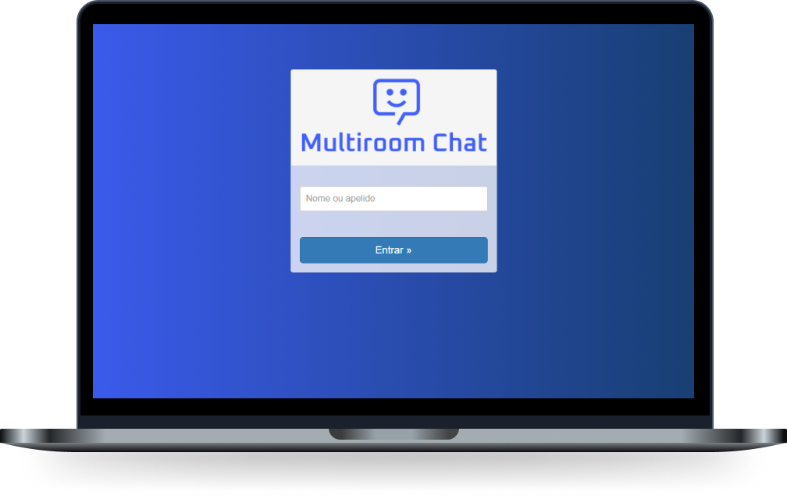

<h1 align="center">
    
</h1>

  <a href="#-tecnologias">Tecnologias</a>&nbsp;&nbsp;&nbsp;|&nbsp;&nbsp;&nbsp;
  <a href="#-projeto">Projeto</a>&nbsp;&nbsp;&nbsp;|&nbsp;&nbsp;&nbsp;
  <a href="#-sobre">Sobre</a>&nbsp;&nbsp;&nbsp;

 

  

## 🚀 Tecnologias

Esse projeto foi desenvolvido com as seguintes tecnologias:

- [Node.js](https://nodejs.org/en/)
- [Socket.io](https://socket.io)
- [Bootstrap](https://getbootstrap.com)
- [HTML](HTML)
- [CSS](CSS)

## 💻 Projeto

O MultiroomChat é uma aplicação que conecta pessoas em um grupo de conversa. 🤝

## 💭 Sobre

O projeto foi desenvolvido a nivel de estudos para conhecer melhor o funcionamento do Socket.io em aplicações NodeJs, nesse projeto você podera encontrar um simples chat responsivo.
